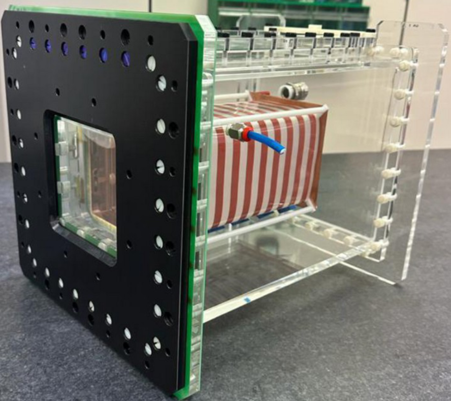
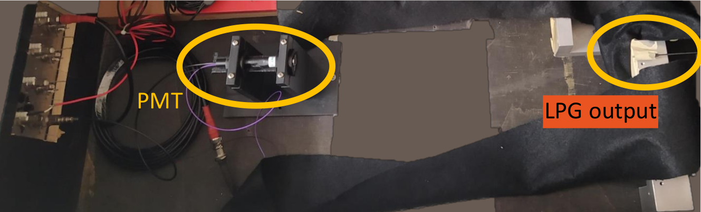
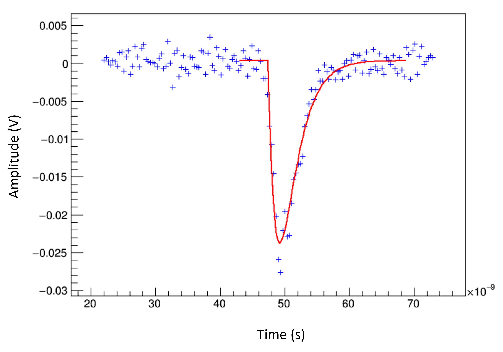
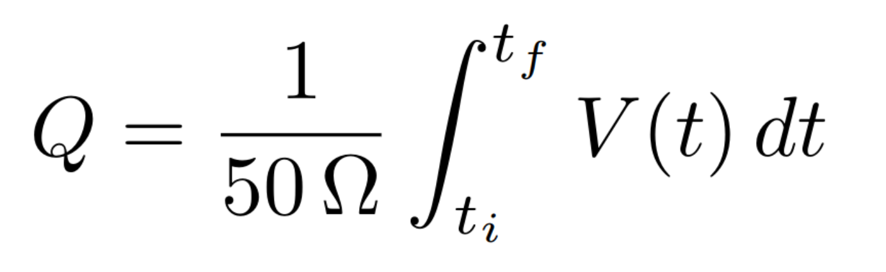

# SC_exam
## Project description
This project was developed within the [CYGNO collaboration](https://web.infn.it/cygnus/cygno/), which aims to develop a one cubic meter demonstrator of a directional TPC for the search of dark matter. The code contained in this project was used to characterize the photomultiplier tubes (PMTs) installed in GIN, a detector prototype to test and validate the field cage and cathode to be installed in CYGNO. Further documentation can be found in the following links:

- G. Dho on behalf of CYGNO collaboration. [The CYGNO experiment](https://indico.cern.ch/event/1360282/contributions/5776328/attachments/2790142/4866164/Slide_CYGNO.pdf)
- F.D. Amaro et al 2023 JINST 18 C09010. [The CYGNO experiment: a directional Dark Matter detector with optical readout](https://iopscience.iop.org/article/10.1088/1748-0221/18/09/C09010)
- [First results on GIN detector](https://agenda.infn.it/event/38654/contributions/217330/attachments/113984/163417/GIN-presentation.pdf)

<p align="center">
  
  <br><em>The GIN prototype. </em>
</p>

### Experimental Setup

The setup, partially enclosed in a black box to avoid external light, consists of the following components:

1. Photomultiplier tubes (PMTs) provided by Hamamatsu
2. Light pulse generator (fast LED driver) which also functions as a trigger for the acquisition of the PMT waveform
3. Tunable high voltage power supply
4. Digital oscilloscope provided by LeCroy

A visible light pulse is produced by the fast LED driver towards the PMT at a specific frequency. With the same frequency, a trigger is sent to the oscilloscope to acquire the PMT voltage signal. The PMT is supplied with different high voltage values to study its response by measuring the produced charge. The result is a gain curve for each PMT.

<p align="center">
  
  <br><em>Setup during the data taking: the PMT is mounted on the left, and the light pulse is sent from the LED driver on the right.</em>
</p>

### Data management

The data used in this project leverages the **INFN cloud infrastructure**. In particular, the analyzed PMT data are stored in the INFN cloud using the **Amazon Simple Storage Service** ([Amazon S3](https://aws.amazon.com/s3/)). The CYGNO data can be explored using the [MinIO Browser](https://minio.cloud.infn.it/minio/), provided access to the [**INFN resources**](https://www.cloud.infn.it/resources/). More details can be found in [this presentation](https://agenda.infn.it/event/36857/contributions/205215/attachments/110758/157862/corso_cloud.pdf) by G. Mazzitelli.

The data consist of single triggered amplitude signals, recorded with a LeCroy digital oscilloscope and saved as .trc files. A typical signal is shown in the figure below, together with a fit of the experimental data with the typical function of a PMT signal:

<p align="center">
  
  <br><em>Typical PMT voltage signal data and fitted function.</em>
</p>

In this project, the data files, if not present locally, are accessed and downloaded through a direct URL call of the type `https://s3.cloud.infn.it/v1/AUTH_xxxxxxx/<bucket-name>/<tag>/<file-name>` .

### Analysis

Due to the high volume of data files, the code is structured to download and process data of different PMTs in parallel. If it is possible to use an HTCondor pool with the installed requirements, the analysis can be performed by sending separate jobs for different PMTs and high voltage values, as explained in [Running with HTCondor](#running-with-htcondor).
Each voltage signal is fitted with the typical PMT signal function, using [PyROOT](https://root.cern/manual/python/). The signal is integrated within the appropriate time range to obtain the produced charge in the PMT, according to the formula:
<p align="center">
  
</p>
The gain for a specific high voltage is then computed as the mean of all signal charges, with the standard deviation associated as its uncertainty. 
The analyzed data in this project come from four different PMTs, in the high voltage range 700-1400 V.

## Files and folders description

   - [analysis.py](./analysis.py) contains the complete analysis code for running locally or using Docker.
   - The [data_info](./data_info) folder contains .txt and .pkl files with information useful for downloading, managing and processing the analysed data.
   - The [requirements.txt](./requirements.txt) file lists the necessary third-party Python libraries.
   - [Dockerfile](./Dockerfile) creates the Docker image necessary to run the application in a Docker container.
   - Files used when [**running with HTCondor**](#running-with-htcondor):
      - [list_directories_condor.py](./list_directories_condor.py) creates the directories to store the data and the output files.
      - [analysis_condor.py](./analysis_condor.py) contains the analysis code.
      - [gain_curve.py](./gain_curve.py) creates the final result of the analysis after the output files produced by the HTCondor jobs have been retrieved.
      - [exec_condor.sh](./exec_condor.sh) is the file executed in the HTCondor jobs, calling [analysis_condor.py](./analysis_condor.py).
      - [submit_condor_jobs.sh](./submit_condor_jobs.sh) generates the submit files for HTCondor.
   - When running the program, the `data` and `outputs` folders are created, containing the downloaded and processed PMT data,output files, and logs.

## Installation and Usage
### Prerequisites

The project uses Python (>= 3.10) and the Python ROOT interface ([PyROOT](https://root.cern/manual/python/)). Additional third-party Python libraries to be installed are listed in [requirements.txt](./requirements.txt). 
Alternatively, the project can be run using Docker. In this case, only [Docker](https://www.docker.com/) needs to be installed.   

### Running Locally

Given that Python, the Python libraries in [requirements.txt](./requirements.txt) and ROOT are installed, the analysis can be performed by doing

   ```bash
   python3 analysis.py
   ```
To receive updates on each processed file, the `--verbose` option can be added to the command above. This will print more output in the log files (see [Outputs](#outputs)).

### Running with Docker

The analysis can also be performed using Docker by executing the following commands:

```bash
docker build -t pmt_analysis .
```
```bash
docker run -it -v $(pwd):/usr/app/ pmt_analysis
```
To receive updates on each processed file, the `--verbose` option can be added to the last command above. This will print more output in the log files (see [Outputs](#outputs)).

### Running with HTCondor

This project can be run in an HTCondor Pool, provided the correct configuration. It is recommended to use the CYGNO Experiment HTCondor queue, on which the project was tested. Access and usage are described in the [mycondor GitHub Repository](https://github.com/CYGNUS-RD/mycondor#cygno-condor-container) by G. Mazzitelli and I. Abritta.
After cloning the project repository in the CYGNO cloud interface, execute the commands:

```bash
python3 list_directories_condor.py
```
```bash
source submit_jobs.sh
```
This will create 4 submit files, corresponding to the 4 different analyzed PMTs, with each job corresponding to a specific high voltage value. When the jobs are done and after retrieving the corresponding outputs with `condor_transfer_data <ClusterID>`, the final result of the analysis is produced with:  

```bash
python3 gain_curve_condor.py
```
### Outputs
During the analysis (locally or with Docker), real-time updates can be found in the .log files produced in the `outputs/logs` folder (which is created when running the program). If the project is run in an HTCondor Pool, upon executing `condor_transfer_data <ClusterID>`, the HTCondor output files can be found in the `outputs/condor_errors`, `outputs/condor_logs`, and `outputs/condor_outputs` subfolders.
The analysis produces Pandas dataframes, saved as .pkl files (found in `outputs/lists` or `outputs/condor_lists`, depending on how the project is run). These are then used to create the final result of the analysis, which are the gain curves, saved as `outputs/gain_curves.png`.

